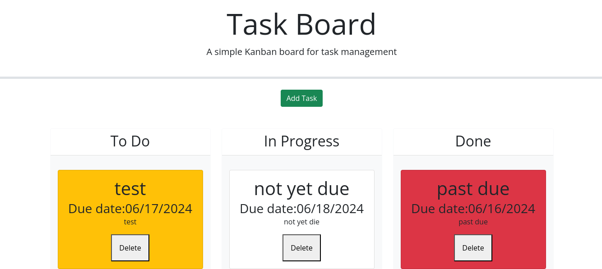

## Task-Board

## Description
This is a challenge assignment for UT Austin's Coding Bootcamp. This week we covered Third-Party APIs and the task was to build a task board that will show a list of individual project tasks with the ability to manage their state of progress and track overall project progress.

## User Story 
AS A project team member with multiple tasks to organize
I WANT a task board 
SO THAT I can add individual project tasks, manage their state of progress and track overall project progress accordingly

## Acceptance Criteria
GIVEN a task board to manage a project
WHEN I open the task board
THEN the list of project tasks is displayed in columns representing the task progress state (Not Yet Started, In Progress, Completed)
WHEN I view the task board for the project
THEN each task is color coded to indicate whether it is nearing the deadline (yellow) or is overdue (red)
WHEN I click on the button to define a new task
THEN I can enter the title, description and deadline date for the new task into a modal dialog
WHEN I click the save button for that task
THEN the properties for that task are saved in localStorage
WHEN I drag a task to a different progress column
THEN the task's progress state is updated accordingly and will stay in the new column after refreshing
WHEN I click the delete button for a task
THEN the task is removed from the task board and will not be added back after refreshing
WHEN I refresh the page
THEN the saved tasks persist

## Usage
Please visit the following link to view the website: https://jknowles10.github.io/Task-Board/

Please visit the following link to view the repository: https://github.com/jknowles10/Task-Board

## Mock-Up

## License
MIT License

## Credits
Day.js library: https://day.js.org/en/
Received help from Daniel Dunnemann
Coding Bootcamp UT Austin